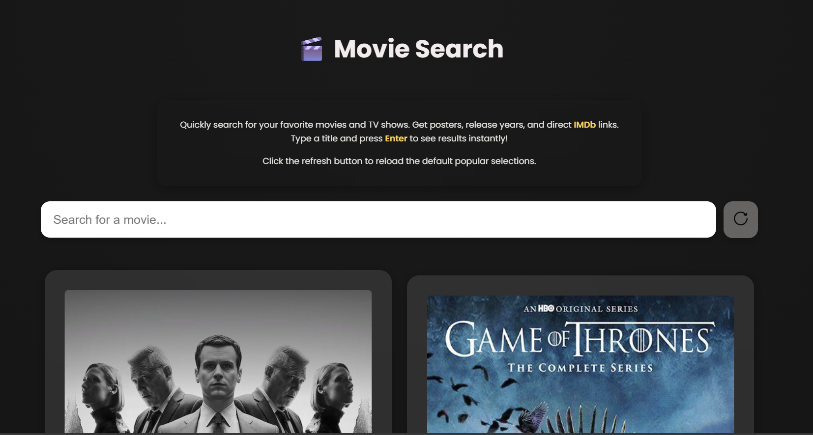

Searching Movies and TV Shows
Description
Searching Movies and TV Shows is a simple web application that allows users to search for movies and TV shows in real time.  
The app provides an easy and fast way to explore entertainment content by typing a title into the search input and instantly receiving results.
Live demo:  
https://searching-movies-and-tv-shows.netlify.app/
Technologies Used
- HTM
- CSS  
- JavaScript  
- Fetch API

Screenshot

 Features
 
- Search for movies and TV shows
- Real-time results without page reload
- Data fetched from an external API
- Clean and user-friendly interface
- Works directly in the browser with no setup
  
How the Application Works

1. The user enters a movie or TV show title in the input field.
2. JavaScript sends a request to an external movie database API.
3. The API returns matching results.
4. The results are dynamically displayed on the page.

This allows users to quickly search and explore movies and TV shows in one place.

 Challenges and Learnings
 
One of the main challenges in this project was working with asynchronous data using the Fetch API and dynamically updating the DOM.  
Through this project, I strengthened my understanding of:
- Handling user input
- Working with APIs
- Asynchronous JavaScript
- Updating the UI dynamically

How to Run the Project
No additional setup is required.
